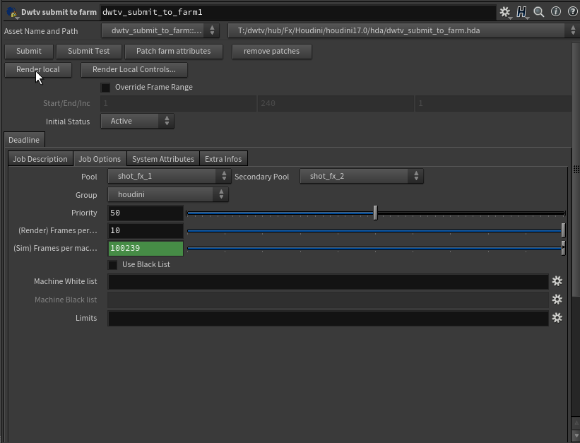

# Submit to farm ROP

The submit to farm tools submits Houdini ROP network to deadline. It's compose of DWTV_submit_to_farm ROP node and underlying python modules to access the Houdini network and handles communication between Houdini and Deadline. 
It supports Houdini network hierarchy so jobs will be run in correct order on Deadline.

## Features
- Rop and deadline Dependency
    - Saves time by sending multiple node to farm at the same time
    - Runs complex simulation that involves multiple steps
- Extensible
    - Support all node types and custom nodes
    - Custom classes to abstract each node's functionality into deadline job
- Per node farm attributes
    - Specify number of frames to run on each rop node

## UI
Most of the [Common Deadline Job Attributes](https://docs.thinkboxsoftware.com/products/deadline/10.0/1_User%20Manual/manual/job-submitting.html#common-job-ref-label)
can be shared amount different software, with some [Houdini specific Job attributes](https://docs.thinkboxsoftware.com/products/deadline/10.0/1_User%20Manual/manual/app-houdini.html)  

### Buttons
| Button  |      Description     |  |
|----------|:-------------:|------:|
| Submit|  Submit network to farm | |
| Submit Test| Output the result at the console  | |
| Patch farm attributes | Add per-node deadline attributes for all the nodes connect to this node|   |
| Remove patches|Remove per-node deadline attributes for all the nodes connect to this node||
| Render local|Render locally||
| Initial Status|Start active or suspended
### Job Description
| Parameter  | Description|  |
|----------|:-------------:|------:|
|Job Name |The name of the job, different job for each node| |
|Batch Name | The name of the Batch which all the jobs in one submission are parent under |
|Comment| | |
|Department|||
---

### Job Options
| Parameter  | Description|  |
|----------|:-------------:|------:|
|Pool | Pool the job belongs to; see [deadline doc](https://docs.thinkboxsoftware.com/products/deadline/10.0/1_User%20Manual/manual/pools-and-groups.html#pools-and-groups-ref-label)| |
|Secondary pool |  ||
|Group| ||
|Priority|A job can have a numeric priority ranging from 0 to 100, where 0 is the lowest priority and 100 is the highest priority.||
|(Render) Frames per machine| Set the number of frames each machine can run for render like Mantra and VRay. The less frame per machine, the faster the render will go but use more farm resources||
|(Sim) Frame per machine| Sim task are usually frame dependent so the default value is to make should only one machine is assigned. But in some cases like outputting cached geometry, you can lower the value to have multiple machine run on it||
| Machine White list| Click on the gear icon to select the machines for the job||
| Machine Black List| Click on the gear icon to select the machines to skip
| Limits |[Deadline Docs about limits](https://docs.thinkboxsoftware.com/products/deadline/10.0/1_User%20Manual/manual/limits.html)||

---
### System Attributes
| Parameter  | |  |
|----------|:-------------:|------:|
|Server address|| |
|User Name |||
|Scene path||
|Machine Name||
|Application Version|||
|Build|||
|Plugin||
|Job|||
---
### Extra Info
- Additional data for farm management

## Usage
### Submit Render
  
1. Create a Mantra Node
2. Create a DWTV_submit_to_farm node and connect the Mantra node
3. Click submit in the DWTV_submit_to_farm node
---
### Cache Sim Geometry
  
 
 
1. Create a Rop Geometry or FileCache Node
2. Create a Fetch Node and set the source to Rop Geometry or FileCache
3. Create a DWTV_submit_to_farm node and connect the Mantra node
4. Click submit in the DWTV_submit_to_farm node
---
### Multi-level dependency

- In this fluid sim example, fluid source and the collider need to be cached out before the simulation. The render shouldn't start until the simulation is done.
- Fluid source and collision cache don't depend on each other, so then are merged
- The same idea as the render and sim example, top node finish first and bottom node start after all nodes above are done.  
---
### Wedging

- Plugging into wedge's input changes the behavior of wedge node, so you can fetch it to the network

[Wedging in Houdini](https://www.sidefx.com/docs/houdini/nodes/out/wedge.html)

---
### Distributed Simulation
- Works the same way as wedging, support direct connection, fetch if you need dependency

[Houdini documentation](https://www.sidefx.com/docs/houdini/dyno/distribute.html)

[Houdini distributed simulations masterclass](https://vimeo.com/148518740)

---
### Change the number of frame when caching
   
1. Make sure the node you want to modify is connect to a submit_to_farm node
2. At the submit to farm node, click Patch farm attribute.
3. New tab 'Farm extra attributes' will be added to the parameters of the nodes
4. Select the frame number in the drop down or select 'custom' to input a number

## Supported Nodes

### Rendering:
- Mantra 
- VRay (VRay Houdini need to be installed on farm)

### Caching/ Simulation:
#### ROP:
- Rop Geometry
- Rop Alembic
- HQ Simulation

#### SOP:
- Rop Geometry
- File Cache
- Rop Alembic

### Utility nodes
- Fetch
- Null
- Merge
- Switch
- Wedge

# Technical Details
## ROP Network Overview
### Node Traversal
Houdini network process rop network with a depth first approach, so the node furthest from the root will get process first.
Nodes with same parent can run at the same time.

### Netvigation Operations
There are functionality supported by the Houdini ROP.
- Fetch
    - Access nodes in SOP network or other ROP node like wedging
- Bypass
    - Don't process the node
- Merge
    - Group group task as the same dependencies
- Switch
    - Choose one operation
- Wedging
    - Process the same network with different value of a parameter
## Deadline Job Structures

- Support dependency with job number
- One job can have multiple task
### Jobs Parameters
[Deadline page Containing all the attributes](https://docs.thinkboxsoftware.com/products/deadline/10.0/1_User%20Manual/manual/manual-submission.html)
- job names, priority, groups, pool, blacklist, meta data such as department and show
- Houdini specific parameters such as Output Driver, Houdini version number
- Node specific attributes such as wedge number that is unique to that node type

### Dependencies
- Deadline Job dependencies controls which job start rendering. 
- Job with dependencies will wait till the dependent node to finish to start process

## Challenges
-  Translating Dependencies from Houdini network to Deadline
    - Houdini define with network structure
    - Deadline define with Job ID
    - Need different ways for Houdini node traversal and Deadline job creation 
- Populating Deadline job properties
    - Deadline Job requires all the properties, but don't need to set in all rop nodes
    - Having to set deadline attribute to all individual nodes is not efficient, need a way to inherit Job Properties
- Recursive calling from Nested Fetch and wedging
- Need ways to limit server status query

## Implementation
### Houdini HDA
- Root of the submission tree
- Define most of the submission attributes

### Deadline submission server
- Deadline submission using request to send request through REST api 
- [Manual Job Submission](https://docs.thinkboxsoftware.com/products/deadline/10.0/1_User%20Manual/manual/manual-submission.html)

### Handling different node type
- Each node has its own class, each of them can overwrite method like get_frame_range and get_output_path to find the attribute 
from different UI element

### Job, submission node
- Split into Job and Submission node, submission handles the traversal in Houdini, Job submission node handles deadline job properties
- Each submission node contains one or more jobs, except utility nodes that won't be submitted to the farm
- All submission node has a link to its parent job, so it can reference their job id when submitted

### Parameter Inheritance
- Inherit from parent job but allow attribute overwrite
- Using a constructor to find the right job class, initiate object and inherit properties from parent. Then use
each class's method to update properties that are unique to the class.

### Per node parameter
- Create the interface in a null node inside the hda
- Populate the UI by copying the UI along the submission tree when requested

### Submitting
- Submission Node and Job Node, Submission Node handling Node traversal(Houdini), Job handling deadline attributes
- Each Submission Node handles 1 or more jobs, but could be empty in case of utility nodes
- Steps: Create Submission Nodes and Job, Build tree, Submit and record job id

### Building tree
- Go through the node, create submission node and job node
- Traverse and collect all the job into the root node

### Submit tree
- Go through the collected jobs, remove duplicated one and submit one by one
- Receive job id from server and store in job object. In next job, find job id and store it in job dependency

### Caching Server Status Query
- Query Sever status using [Deadline REST API](https://docs.thinkboxsoftware.com/products/deadline/10.0/1_User%20Manual/manual/rest-overview.html)
- Store the server result in dictionary with the query type as name and the query time as value
- If the difference between current and last query time is too small, use the old query time

### Error Handling
- Specific error on different level of the hierarchy, for example, job and submission node have their own error class
- Errors are abstracted but the message are passed so user can identify lower level errors.
